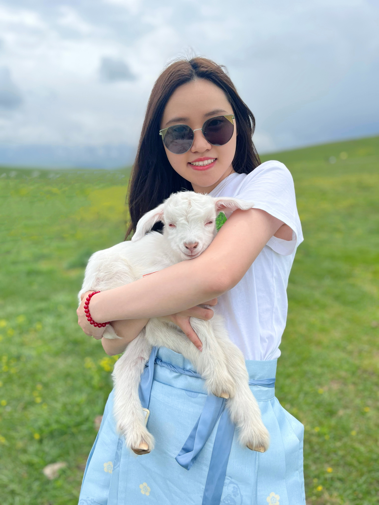
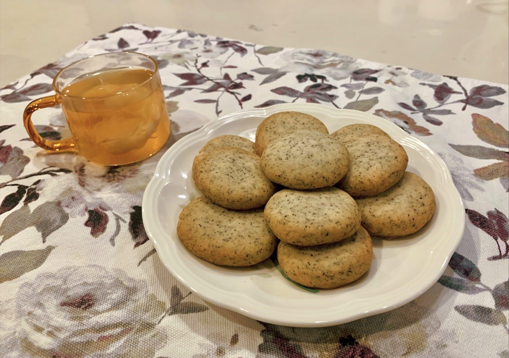
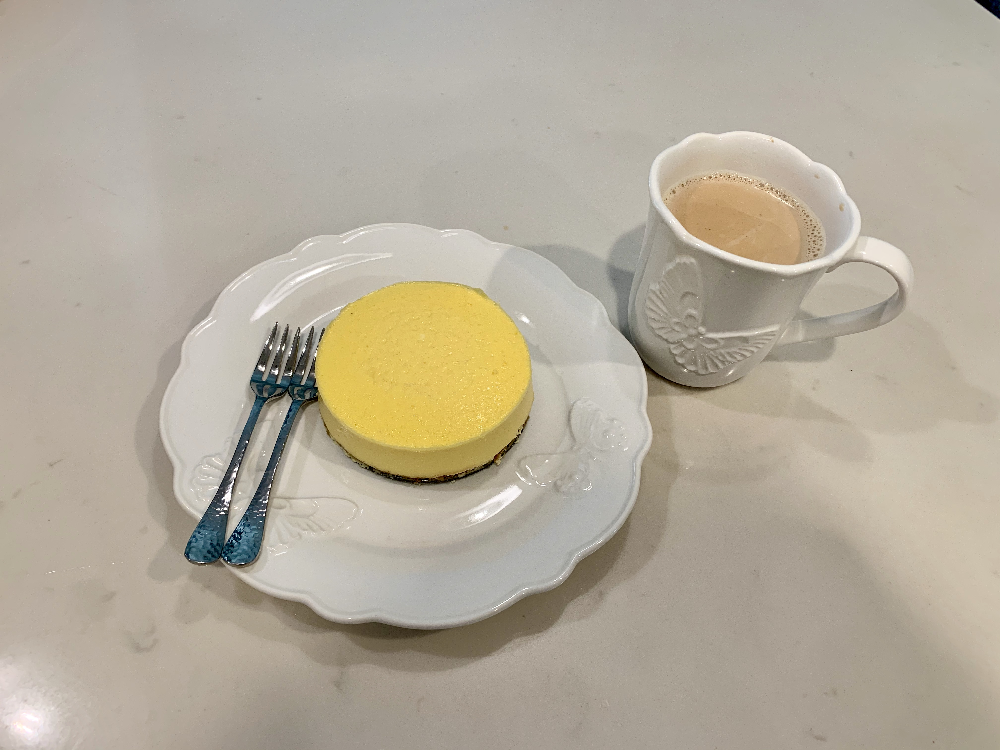
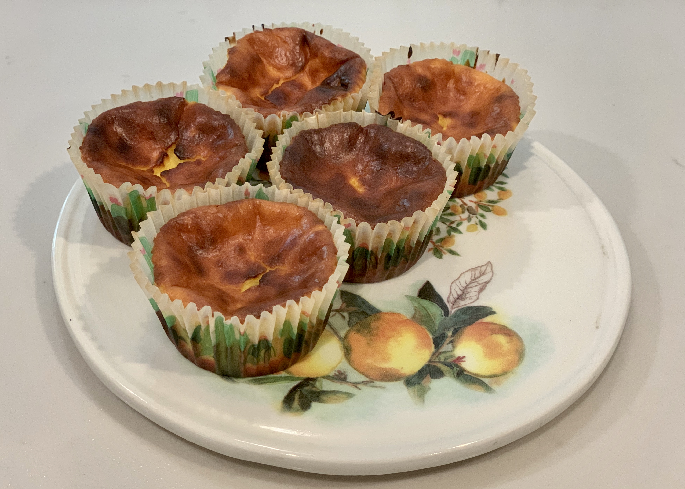

Hello! This is Lesi He ; ) \

<figure class="center-container">
    
    <figcaption>Xinjiang, China</figcaption>
</figure>

I also go by Celia (which has a pronunciation similar to my nickname in Cantonese). I was born in Guangzhou, China, and moved to California during my high school years. Traveling has always been one of my greatest passions, and I relish the opportunity to explore new places and cultures.\

<figure class="center-container">
    
    <figcaption>Puerto Rico</figcaption>
</figure>

<figure class="center-container">
    
    <figcaption>Egypt</figcaption>
</figure>

 \
When I'm not on the road, I can often be found in the kitchen, experimenting with new recipes and cooking techniques: 
   
 \
 

### Website
This website illustrates some of my projects conducted during the MS program at Columbia University.
 \

### Resume
If you are interested in my resume, please contact me via [lh3109@caa.columbia.edu](mailto:lh3109@caa.columbia.edu)