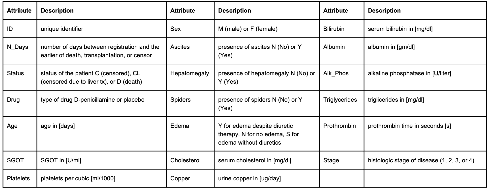

Group 1: Fiona Li, Peilin Zhou, Lesi He, Hao Zheng, Yihan Qiu\

## Introduction

Each year, approximately one million deaths are due to complications of cirrhosis, making cirrhosis the 11th most common cause of death globally [1]. Cirrhosis is a late stage of scarring (fibrosis) of the liver caused by long-term liver damage. Causes of cirrhosis include alcoholism, problems affecting the bile ducts, immune system inherited conditions and long-term use of certain medicines. Generally, there is no effective cure for cirrhosis for now, however, there are ways that may be able to stop cirrhosis from getting worse, such as healthy lifestyle and treating the problem that led to cirrhosis.

D-penicillamine, which primarily can decrease hepatic copper by increasing urinary copper excretion, inhibit fibrogenesis and prevent the appearance of scar lesions in the liver, is used for patients with primary biliary cirrhosis. 
However, for patients who are recommended to take emergency liver transplantation, D-penicillamine is debated whether it’s effective with treating acute liver failure [4,5]. Our project aims to investigate whether taking D-penicillamine 
or not can affect the survival rate of cirrhosis patients.\
      \
      
## Data 
The [Cirrhosis Prediction Dataset](https://www.kaggle.com/datasets/fedesoriano/cirrhosis-prediction-dataset) contains the information of 424 patients with primary biliary cirrhosis collected from the Mayo Clinic trial between 1974 and 1984. After data cleaning process, 276 patients are remained for further analysis

 \
   \ 
 
## EDA

## Methods & Results
### Life Table
Life table is an approach commonly used in survival analysis to describe the mortality experience of a cohort of people.It is used in continuous survival data. Here, we created life tables for D-penicillamine (treatment) and placebo (control) groups:\
 \
D-penicillamine:\
  \
 \
Placebo:\
 

The median survival time for D-penicillamine (Treatment) is 8.5 years, and the median survival time for placebo (Control) is 9.4 years.\
  \

### KM

 
 \

### Log-rank Test
We performed a log-rank test comparing D-penicillamine (Treatment) and Placebo (Control): \
* Null Hypothesis: there is no difference in survival distributions between treatment and control groups. \
* Alternative Hypothesis: there is significant difference in survival distributions between treatment and control groups. 
Significance level: alpha = 0.05 \
   \
 

  \
Since p-value = 0.5 > 0.05, we fail to reject the null hypothesis and conclude that there is no difference between the populations in the probability of an event (death) at any time point between treatment and control groups.\
  \

### Cox PH Model
To evaluate simultaneously the effect of several factors on the hazard rate of a particular event at a particular point in time, we utilized the COX PH Model.Here are the steps:\
1. Fit a full model \
2. Perform backward stepwise variable selection (AIC) \
3. Refit model with selected variables and treatment variable
4. Check model assumptions with schoenfeld residual test and plot \
5. Add time-varying covariates/stratification and check assumptions again \
6. Fit final model \
   \
After performing variable selection, the variables are reduced to: treatment, age, edema, bilirubin, albumin, copper, sgot, prothrombin, stage (Treatment variable is kept in the model for research purpose). \
 \
 
We checked the model assumption through Schoenfeld residual test:\
   

As shown in the plots, Bilirubin and prothrombin seem to be time-dependent: from the start of the study to around 1100 days, and from 1100 days to the end of study. Hence, we needed to fit a cox model with time-varying coefficients

Our final model is stratified by time group and interact with the two covariates.
From the table, we can see that the treatment variable is not statistically significant to the model (p value = 0.67) \
 

Interpreting the table, we can see that: \

* Bilirubin variable in time group 1 has a hazard ratio of 1.07 and its hazard ratio increases to 1.20 in time group 2 (both have p value smaller than 0.05), indicating that patients with lower serum bilirubin level are more likely to survive.
* Prothrombin variable:
  * From the start of the study to 1100 days (time group = 1), it has a hazard ratio of 1.57 with a p value < 0.05, suggesting that patients with shorter prothrombin time (in seconds) are more likely to survive;
  * From the 1100th day to the end of the study (time group = 2), its hazard ratio has a p value larger than 0.05, suggesting that this variable is not statistically significant.
* Albumin variable has hazard ratio of 0.49 with a p value < 0.05, indicating that the patients with relatively higher albumin level are more likely to survive.
* EdemaY variable has a hazard ratio of 2.53 with a p value < 0.05, suggesting that the patients who have edema despite diuretic therapy have higher risk of death comparing to those without edema.\
 \
 
## Conclusion
The drug D-penicillamine does not have statistically significant contribution to improve the survival rate of cirrhosis patients.
Maintaining a normal range of serum albumin level (3.8 to 5.1g/dl) is crucial for lowering the risk of death for cirrhosis patients  \
 \
 
## Discussion
The log-rank test is purely a significance test and cannot provide an estimate of the size of the difference between the groups and its related confidence interval. In this project, liver transplant is considered as a censoring event. The K-M estimator can lead to overestimation of cumulative incidence. An alternative method, competing risk regression, can be applied to this dataset to deal with this problem in the future. \
 \

## References
[1] Asrani SK, Devarbhavi H, Eaton J, Kamath PS (January 2019). "Burden of liver diseases in the world". Journal of Hepatology. 70 (1): 151–171.\
[2] Villarroel MA, Blackwell DL, Jen A. Tables of Summary Health Statistics for U.S. Adults: 2018 National Health Interview Survey. National Center for Health Statistics. 2019. Available from: http://www.cdc.gov/nchs/nhis/SHS/tables.html \
[3] Centers for Disease Control and Prevention, National Center for Health Statistics. National Vital Statistics System, Mortality 1999-2020 on CDC WONDER Online Database, released in 2021. Data are from the Multiple Cause of Death Files, 1999-2020, as compiled from data provided by the 57 vital statistics jurisdictions through the Vital Statistics Cooperative Program. Accessed at http://wonder.cdc.gov/ucd-icd10.html   \
[4] Bellary S, Hassaneim T, Van Thiel DH (1995) Liver transplantation for Wilson's disease. J Hepatol 23:373–381. /
[5] Stampfl DA, Munoz SJ, Moritz MJ, et al. (1990) Heterotopic liver transplantation for fulminant Wilson's disease. Gastroenterology 99:1834–1836. \
[6] fedesoriano. (August 2021). Cirrhosis Prediction Dataset. Retrieved [Date Retrieved] from https://www.kaggle.com/fedesoriano/cirrhosis-prediction-dataset. \
[7] Stel, V.S. et al. (2011) Survival analysis I: The kaplan-meier method, Nephron Clinical Practice. Karger Publishers. Available at: https://www.karger.com/Article/Fulltext/324758#:~:text=A%20limitation%20of%20the%20KM,and%20its%20related%20confidence%20interval. (Accessed: December 3, 2022).  \
